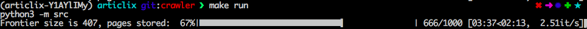
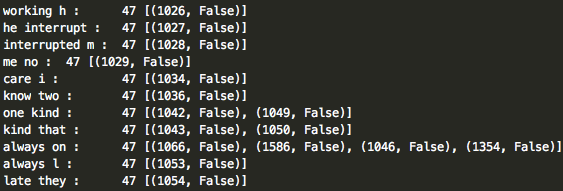

# articlix

Information retrieval project at SPbAU 7th term

## Installation

### Dev

We use [pipenv](https://docs.pipenv.org/) as a primary tool for development.  
See [Pipfile](Pipfile), [Pipfile.lock](Pipfile.lock), 
[requirements-dev.txt](requirements-dev.txt) and
[requirements.txt](requirements.txt) for full specification of platform, python
and dependency packages.

### Makefile

We provided [Makefile](Makefile) for convinient commands implementation.  
Run `make help` for get info on that.

### Prerequisites

* **psql>=10.0** for [crawler](crawler/crawler.py) to store pages

## Usage

`make help`

### Crawler

Run the Crawler with `make task=crawler run` (default task)!

### Index

Then, build the Index with `make task=index run`!

## License

[MIT](LICENSE)